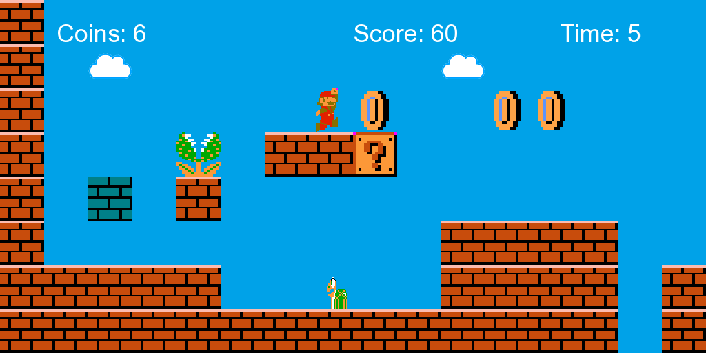
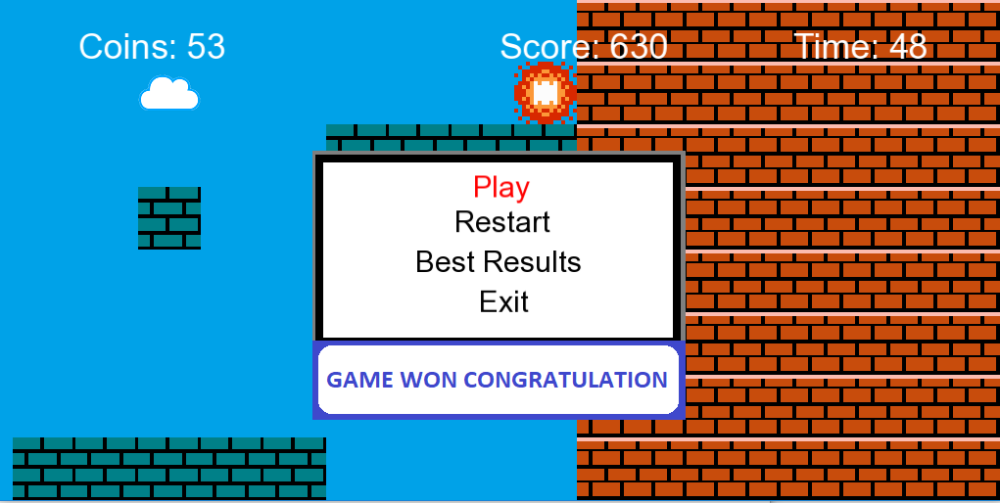
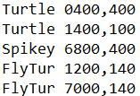

# Mario type game
Object-oriented C++ mario type game coded using *SFML library* by Nijiya, Sadhana and Rubika.

## Short description:
The objective of this game is to reach the finish line avoid oponents and collecting coins on the way.
User controlls figure by arrows. The mechanism allows main figure running and jumping.

The player gains points by defeating multiple enemies consecutively and collecting conis and bonuses. 
Enemies are defeated by kicking them over. The faster user gets to the finish portal, the more points will be gained.

  

  

  

## Map manipulation
#### The map was created based on template:

  

Every number corresponds with every image block taken from template. Game loads map from assets/array.txt, user can open file and edit blocks in the desired way.
Number of columns can be increased (longer map) or decreased (shorter map), adding additional row won't change map in any way.

  

#### Mobs:
Mobs are builed based on assets/mobs.txt file.
Way mobs are stored:
[mob_name] [px_on_X_as_axis], [px_on_Y_as_axis]
Avaliable mobs names are: Turtle, Spikey, FlyTur, Bonus.

  

# Specyfication:

  
  

## Description:
**_Games_** class is the main game controller. Responsible for adding mobs, triggering tileMap class map managament, updating objects and displaying menu if needed.
Takes care of camera movements (cameraMovement()).

Every object belonging to **_entity_** class is kept in std::vector<Entity> mobs, loaded from assets/mobs.txt file. 
**_GameInfo_** class is responsible for counting user score, amount of coins gathered and time passed. Result is saved into the text file after finishing the game.
 Class **_Menu_** loads 3 best results after choosing option Best Results in menu.
 By clicking F1 key user can create screenshot saved in screenshot folder.
