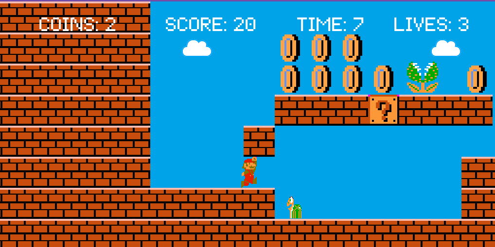
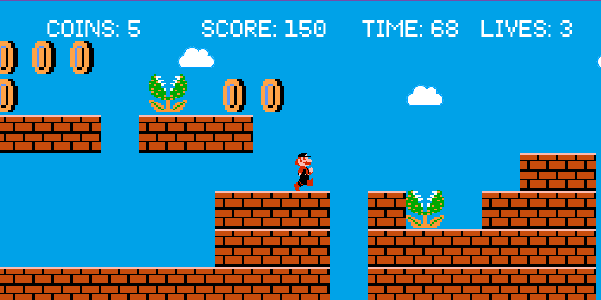
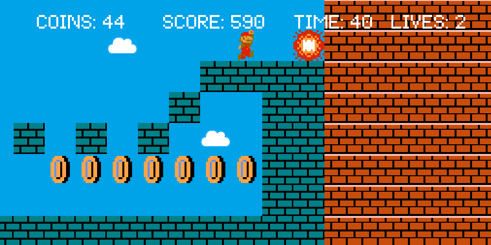
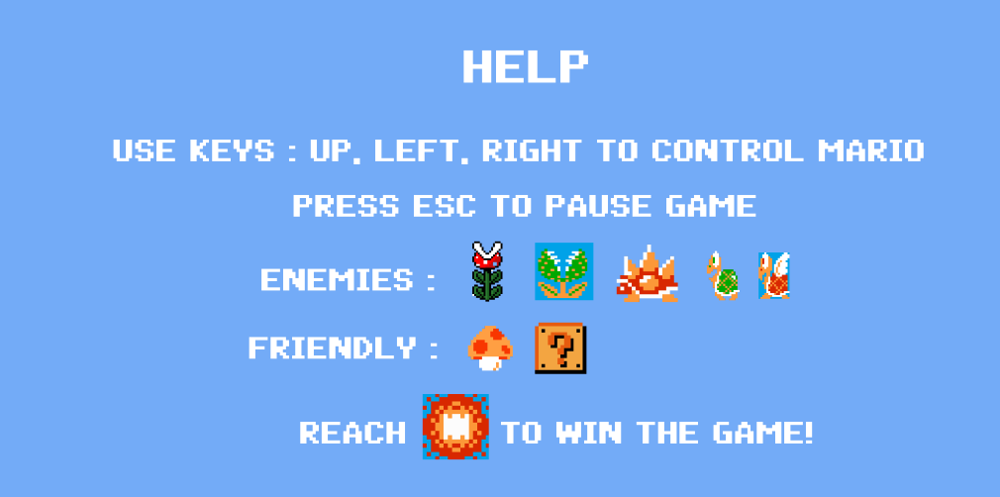
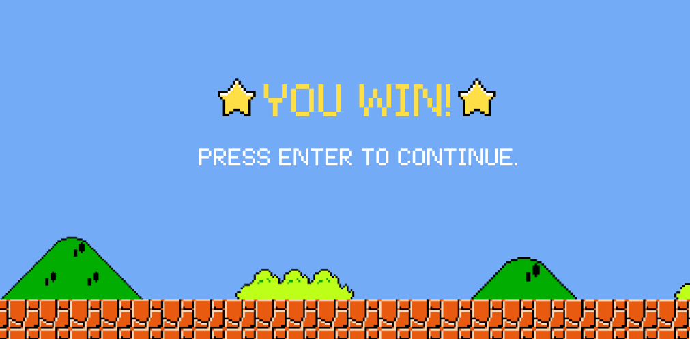
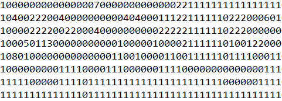
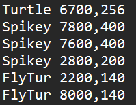

# MARIO
Mario created with Object-Oriented Programming in C++ using SFML. 
Coded by Nijiya, Rubika and Sadhana for OOP Project BCT(II/I).

## Description:
This project is a recreation of the classic platformer game Mario. It aims to capture the essence of the beloved Mario game, offering players an opportunity to relive the excitement of running, jumping, and navigating through a unique level while facing challenges and enemies.

The game is controlled using Keyboard Arrows. (Up, Down, Left, Right)

  

  

  

  

  

### Compiling Instructions:

1. Open Mario.sln (contained in the root folder) in Visual Studio.
2. Choose the build configuration "Debug" and the target platform "x64".
3. Build the solution by clicking on the "Build" menu and selecting "Build Solution" (or press Ctrl+Shift+B).
4. Click on "Local Windows Debugger", or open Mario.exe located at "/x64/Debug".

### Map Manipulation
#### The map was created based on template:

  

Every number corresponds with an image block taken from template. Game loads map from assets/array.txt. User can open file and edit blocks in the desired way. Number of columns can be increased (longer map) or decreased (shorter map), adding additional row won't change map in any way.

  

#### Mobs:
Mobs are built based on assets/mobs.txt file.
Way mobs are stored:
[mob_name] [x-coordinates], [y-coordinates]
Available mobs names are: Turtle, Spikey, FlyTur, Bonus.

  

### Specification:

  
  

**_Game_** class is the main game controller. Responsible for adding mobs, triggering tileMap class. map managament, updating objects and displaying menu if needed.
Takes care of camera movements (cameraMovement()).

Every object belonging to **_entity_** class is kept in std::vector<Entity> mobs, loaded from assets/mobs.txt file. 
**_GameInfo_** class is responsible for counting user score, amount of coins gathered and time passed. Result is saved into the text file after finishing the game.
 Class **_Menu_** loads 3 best results after choosing option Best Results in menu.
